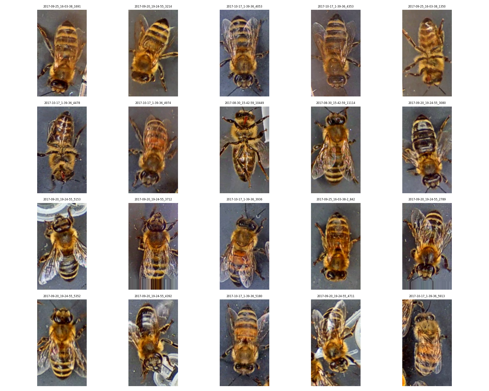
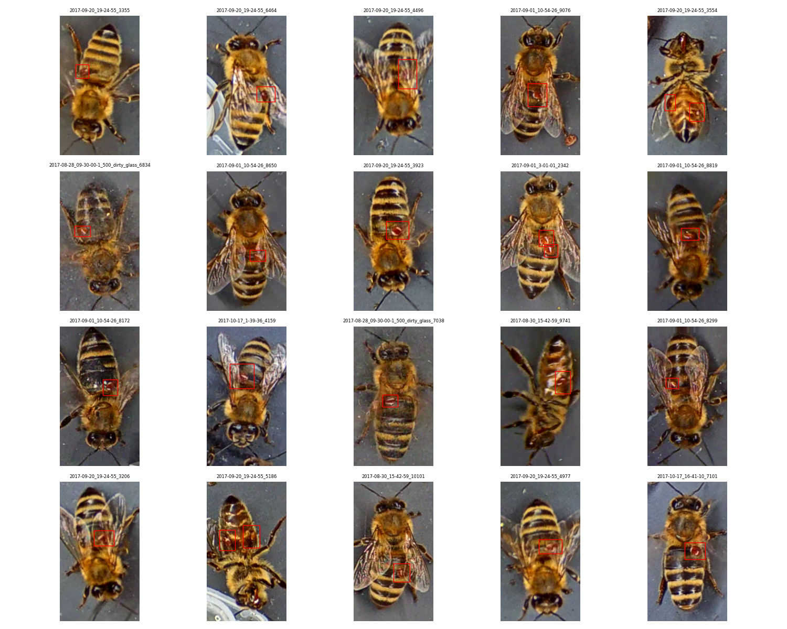
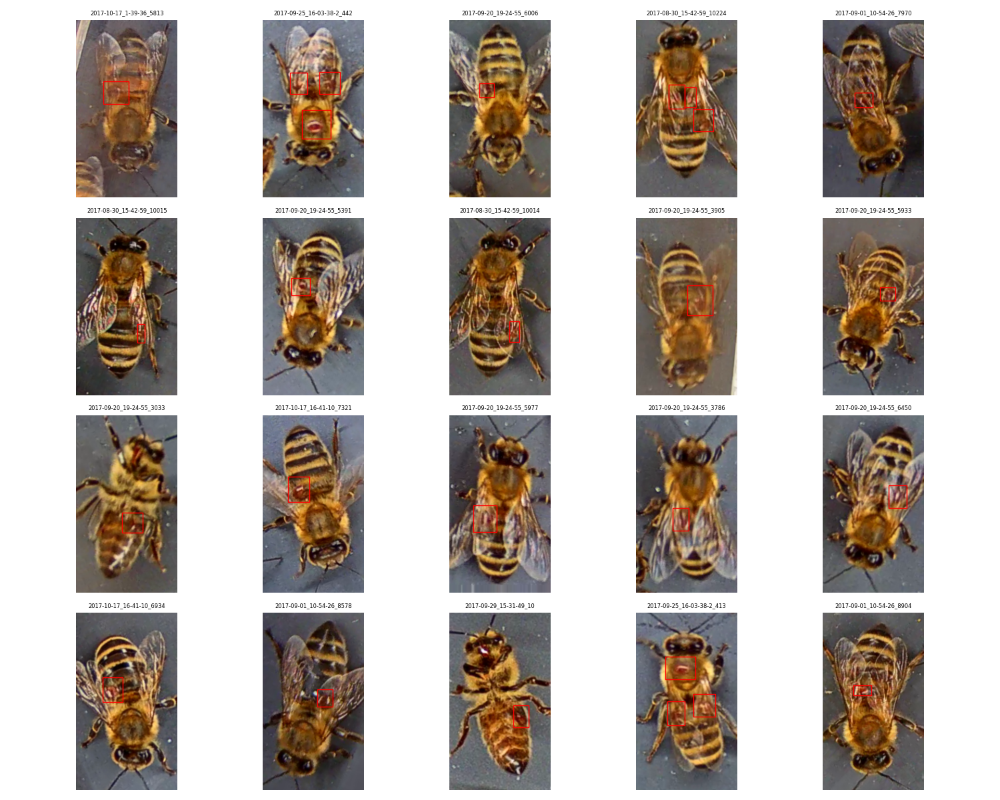
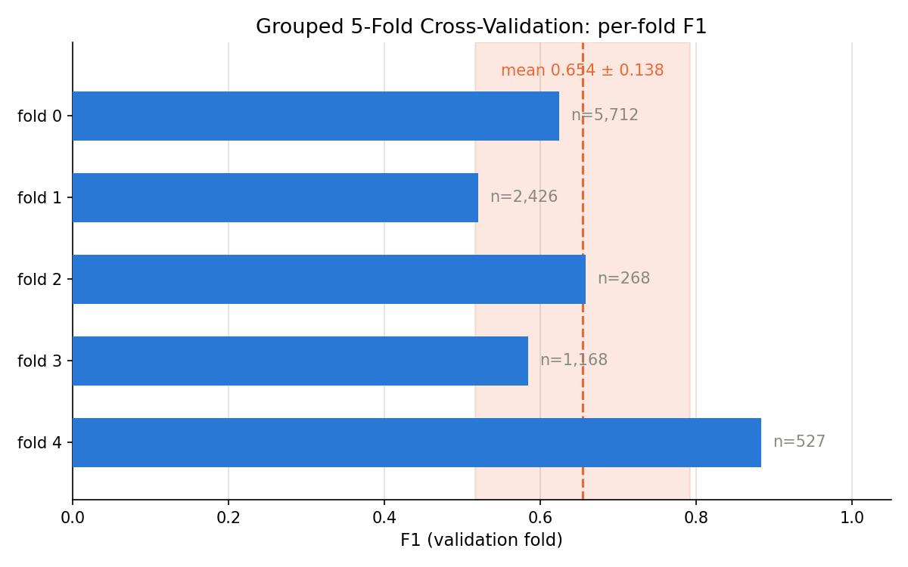
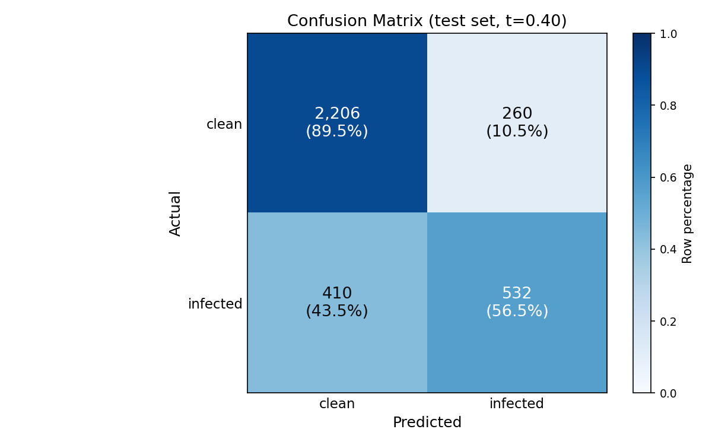
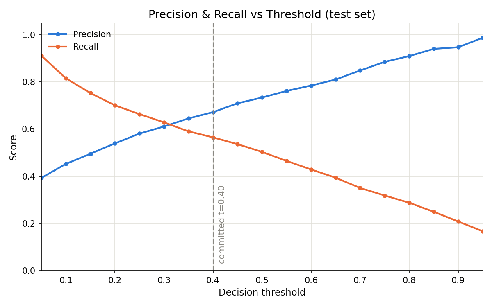
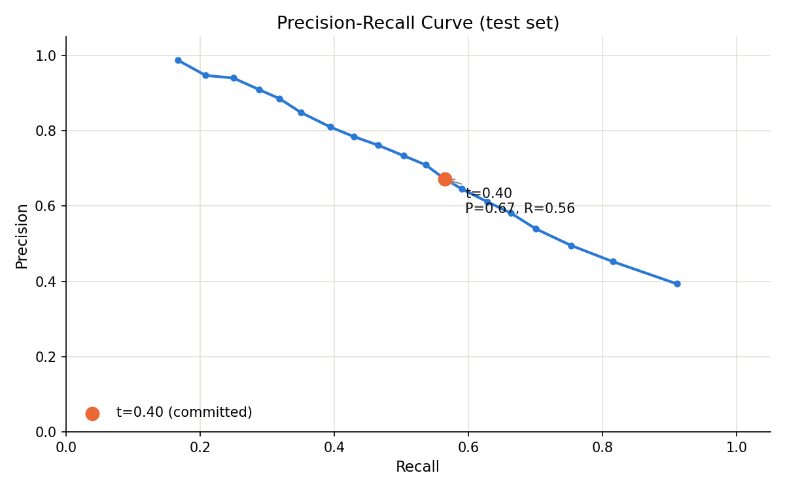

# Varroa Mite Classifier

Binary image classification: does a bee in a photo have a visible *Varroa destructor* mite?

This is a rebuild from scratch. The original public implementation of this task split its data at the image level, which places near-duplicate frames of the same bee on both sides of the train/test boundary. That inflates every reported metric. Rebuilding the pipeline meant every split, threshold, and hyperparameter decision could be checked — and while doing so I found the same class of leakage in the dataset's own published split.

**Headline results**

| | |
|---|---|
| Grouped 5-fold cross-validation | F1 **0.654 ± 0.138** |
| Held-out test set | F1 **0.614**, precision 0.672, recall 0.565, accuracy 0.803 |
| Majority-class baseline (test) | accuracy 0.724 |
| Decision threshold | 0.40, committed before the test set was opened |

The cross-validated figure is the better estimate of generalization. The test figure is one independent draw that checks it, and it landed inside the CV range.

---

## Data

[VarroaDataset](https://doi.org/10.5281/zenodo.4085044) (Zenodo DOI 10.5281/zenodo.4085044): 13,509 images at 160×280, cropped from 13 laboratory videos of bees passing a camera.

The published split:

| split | images | videos |
|---|---|---|
| train | 8,225 | 6 |
| val | 1,876 | 5 |
| test | 3,408 | 2 |

### The undocumented label

`gt.csv` contains labels `0`, `1`, and an undocumented `3`. Nothing in the dataset description explains the third value. I mapped both `1` and `3` to "infected", on three pieces of evidence:

1. The Zenodo record states 3,947 infected and 9,562 healthy samples. Label `1` accounts for 3,083 images and label `3` for 864 — the published positive count only reconciles if `3` is included (3,083 + 864 = 3,947). Treating `3` as healthy would give 3,083 positives, which contradicts the record.
2. The bounding boxes attached to `1` and `3` have identical dimensions.
3. Visual inspection shows the same object.





An ablation excluding label-3 images was planned but not run.

---

## The leakage finding

Two entries in the dataset are listed as separate videos:

```
2017-09-25_16-03-38      915 images   bee_id  228 – 1215   (published split: train)
2017-09-25_16-03-38-2    958 images   bee_id 1216 – 2238   (published split: val)
```

They are one continuous recording session split across two files. The timestamps are identical to the second, and the `bee_id` ranges are contiguous — 228–1215, then 1216–2238, with no gap and no overlap. Bees near the boundary were recorded seconds apart.

**The published split places one file in train and the other in val.** That means 958 of the 1,876 validation images — **51%** — come from a recording session the model trained on: same hive, same lighting, same camera angle, in some cases adjacent bees.

Every metric derived from the published split is therefore optimistic by an unknown margin. The cross-validation below groups by **recording session** rather than by video filename, so these two files always travel together.

For contrast, the two test videos were checked and are clean: no session overlap with train or val, and no contiguous `bee_id` chain that would suggest a shared recording.

---

## Model

MobileNetV2 with ImageNet-pretrained weights. The 1,000-class head is replaced with `Dropout(0.2)` + `Linear(1280, 2)`.

MobileNetV2 was chosen over ResNet because training was CPU-only. Depthwise-separable convolutions cut the multiply-accumulate count by roughly an order of magnitude at comparable accuracy, and epoch wall-clock — not accuracy ceiling — was the binding constraint on iteration speed.

**Final configuration**

| | |
|---|---|
| Backbone | MobileNetV2, last feature block unfrozen |
| Trainable parameters | 414,722 (2,562 with the backbone fully frozen) |
| Learning rates | head 1e-3, unfrozen backbone 1e-4 |
| Loss | CrossEntropyLoss, unweighted |
| Epochs | 15, checkpointing on best validation loss |
| BatchNorm | running statistics frozen across the whole backbone |

The discriminative learning rates matter. The head is randomly initialized and needs large steps; the unfrozen backbone weights are already good and need gentle ones. Training both at 1e-3 destroys the pretrained features in the first few batches and yields a model worse than fully frozen.

Freezing BatchNorm running statistics was a deliberate choice: `requires_grad = False` freezes *parameters*, but BN buffers keep updating in train mode regardless. Pinning them via `model.features.eval()` costs a small amount of domain adaptation and buys reproducibility across experiments, which mattered more here.

---

## Development

Four experiments, run one variable at a time against a frozen baseline. The order was chosen by cost, cheapest first — which turned out to matter, because the first experiment overturned the diagnosis that motivated the rest.

### Accuracy is the wrong metric here

The frozen baseline scored **84.3% accuracy** against a 76% always-predict-healthy baseline. That reads as an 8-point gain over guessing.

The confusion matrix says something different:

```
                        predicted
                    healthy    infected
actually healthy      1394         31
actually infected      264        187
```

**451 bees had mites. The model found 187 and missed 264** — recall 0.415. Precision was 0.858, so it was usually right when it spoke; it just stayed silent most of the time. That is the standard outcome under class imbalance: during training, predicting the majority class is the cheaper way to lower loss.

Accuracy gave no hint of any of this.

### 1. Threshold tuning — the largest single gain, for free

The model outputs a confidence score between 0 and 1. `argmax` over two logits is a decision cutoff of exactly 0.50 — a default, not a law.

```
cutoff 0.50   recall 0.415    misses 264 infected bees
cutoff 0.15   recall 0.809    misses 86
```

Same weights, no retraining, 178 more infections caught. The signal was there the whole time; the model just was not confident enough to cross 0.50.

This also corrected a wrong diagnosis. Per-video recall had ranged 8× across the five validation videos (0.067 to 0.549), which looked like the model failing under specific recording conditions. At the lower cutoff:

| video | recall @ 0.50 | recall @ 0.15 |
|---|---|---|
| 2017-08-28_16-32-55 | 0.419 | 0.871 |
| 2017-09-01_20-00-17 | 0.094 | 0.585 |
| 2017-09-01_3-01-01 | 0.549 | 0.920 |
| 2017-09-25_16-03-38 | 0.403 | 0.750 |
| 2017-09-29_15-31-49 | 0.067 | 0.600 |

The two apparently broken videos improved the most, and the spread collapsed from 8× to 1.6×. It was a calibration problem, not a representation one — and finding that out cost two minutes of computation rather than a training run.

### 2. Class weighting — a negative result

Inverse-frequency weights (`[0.725, 1.610]`, ratio 2.22) make errors on the minority class cost more during training, so the model should learn a less conservative boundary rather than needing one imposed afterward.

Compared at matched recall, it was **equivalent, not better**:

| recall | baseline precision | weighted precision |
|---|---|---|
| ~0.89 | 0.405 | 0.412 |
| ~0.80 | 0.493 | 0.516 |
| ~0.64 | 0.686 | 0.691 |
| ~0.42 | 0.858 | 0.842 |

Differences under 0.02, alternating in sign. Best F1 **0.662 vs 0.663** — a tie.

Both mechanisms do the same thing: shift where the decision boundary sits, one during training and one after. Neither changed the underlying ranking of images by predicted probability. Thresholding was kept, because it needs no retraining and stays adjustable after deployment.

Two experiments hitting an identical ceiling is itself informative — it says the limit lies in the features, not the decision rule.

### 3. Unfreezing the last block — the only change that moved the curve

Two independent signals pointed at capacity: training loss had plateaued at 0.43 and would not move across 30 epochs, and both decision-rule experiments stopped at the same F1.

Unfreezing the final MobileNetV2 block (2,562 → 414,722 trainable parameters, backbone at 1e-4) improved **every point** on the precision-recall curve:

| recall | frozen precision | unfrozen precision |
|---|---|---|
| ~0.81 | 0.493 | 0.573 |
| ~0.74 | 0.569 | 0.665 |
| ~0.64 | 0.686 | 0.795 |

Best F1 **0.663 → 0.712**. At a matched detection rate, false positives fell from 375 to 271.

Unlike the first two experiments, this one overfits: validation loss bottomed at epoch 5 of 15 while training loss kept falling to 0.19. With 414,722 parameters against six independent recording sessions, that is expected, and best-epoch checkpointing is doing real work in the reported number.

### 4. Label-3 ablation

Planned, not run. Listed under limitations.

---

## Cross-validation

Every number above came from a single train/validation split that I did not choose. Given that per-video performance varied substantially, "F1 0.712" was really "F1 0.712 on these five videos."

Five folds, grouped by **recording session**, over the 11 non-test videos — 10 sessions after merging the pair identified above. The test set was excluded entirely.

| fold | val images | positives | best epoch | threshold | precision | recall | F1 |
|---|---|---|---|---|---|---|---|
| 0 | 5,712 | 31.4% | 6 | 0.40 | 0.583 | 0.671 | 0.624 |
| 1 | 2,426 | 18.8% | 2 | 0.45 | 0.438 | 0.639 | 0.520 |
| 2 | 268 | 31.3% | 4 | 0.20 | 0.529 | 0.869 | 0.658 |
| 3 | 1,168 | 39.0% | 1 | 0.10 | 0.500 | 0.701 | 0.584 |
| 4 | 527 | 41.4% | 9 | 0.70 | 0.938 | 0.835 | 0.883 |

```
precision  0.598 ± 0.197
recall     0.743 ± 0.103
f1         0.654 ± 0.138
```



Three things this table says that a single number cannot:

**The threshold does not transfer.** Each fold's optimum ranged from 0.10 to 0.70. Because each fold tuned on its own validation data, 0.654 is an **upper bound** — a single fixed cutoff would score lower.

**Folds are uneven by design.** Sessions range from 5 to 3,839 images, so grouping honestly produces validation sets from 268 to 5,712. Fold 2's F1 rests on 268 images and is noisy; fold 0 trains on only 43% of the available data and is penalized for it. Part of the ±0.138 is fold size, not model variance.

**One recording condition breaks the model.** Fold 3 validates on `2017-08-28_09-30-00-1_500_dirty_glass`, and its validation loss was 2–4× its training loss and rising from epoch 1. That is distribution shift, not overfitting — the model has little to transfer to degraded image quality.

---

## Test set

The final model was trained on 9 sessions, holding out `2017-08-30_15-42-59` purely as an early-stopping signal, not a performance estimate. Best epoch 9, holdout validation loss 0.4205.

**The threshold 0.40 was committed before the test set was opened**, chosen as the median of the five per-fold optima above. It is defined in `src/training/train_final.py` and imported by the evaluation script rather than retyped, so it could not be quietly revised after seeing results.

```
precision 0.672    recall 0.565    F1 0.614    accuracy 0.803
tp = 532    tn = 2206    fp = 260    fn = 410
```



Majority-class baseline accuracy on test: 0.724.




**Two things worth stating.**

The test F1 of 0.614 fell inside the cross-validated range of 0.654 ± 0.138. The CV estimate was honest — it did not flatter the model, which is the more important result than the number itself.

The committed threshold gave F1 0.614; the test-optimal threshold was 0.30 at F1 0.620. A gap of 0.006, with the choice fixed in advance. The curve is also flat between roughly 0.20 and 0.45, so on this data the exact operating point matters less than the cross-validation spread suggested.

### Per video

| video | images | positives | precision | recall | F1 |
|---|---|---|---|---|---|
| 2017-09-01_10-54-26 | 1,278 | 48.3% | 0.794 | 0.569 | 0.663 |
| 2017-10-17_1-39-36 | 2,130 | 15.3% | 0.517 | 0.557 | 0.536 |

Recall is nearly identical across the two — 0.569 and 0.557. Precision differs because **prevalence** differs: at 15% infection, the same false-positive rate produces far more false alarms relative to true ones. This is arithmetic, not the model working better on one recording. Reading the F1 column alone would give the wrong conclusion.

---

## Limitations

**Ten independent recording sessions.** The effective sample size for generalization is closer to 10 than to 13,509. Images within a session share hive, lighting, camera angle, and often the same bee.

**The threshold does not transfer between hives.** Per-fold optima ranged 0.10–0.70. A deployment would need per-hive calibration, and the reported CV figure assumes tuning that a fixed deployment cannot do.

**The tool undercounts infestation.** Run on the 48.3%-infected test video, it flagged 34.6% — about 14 points low. Averaging raw probabilities instead of counting flags gave 33.9%, no better. The reason is that the missed bees score around 0.02–0.15, not near the cutoff: the model does not see those mites at all, so no decision rule recovers them. This is the same lesson as the class-weighting result, in a different form.

**Degraded image quality is out of distribution.** The `dirty_glass` recording behaved as distribution shift, not overfitting.

**Label 3 was assumed, not verified by ablation.** The evidence is strong but indirect.

**Laboratory data, single hive setup.** Field performance is unknown. This is not production-ready.

---

## Usage

```bash
# Build data/processed/metadata.csv from gt.csv
python -m src.data.inspect_data

# Train the final model (9 sessions, 1 held out for early stopping)
python -m src.training.train_final

# Evaluate on the sealed test set at the committed threshold
python -m src.evaluation.evaluate_test

# Grouped 5-fold cross-validation (~90 minutes on CPU)
python -m src.evaluation.cross_validate

# Regenerate README figures
python -m src.evaluation.plots

# Single image
python -m src.predict path/to/bee.png

# Directory: prints per-image scores, then flagged % and mean probability
python -m src.predict path/to/folder/
```

`predict.py` defaults to the committed threshold and the final checkpoint, so running it with no flags reproduces the evaluated configuration exactly.

---

## Project layout

```
src/
  config.py                    paths and constants
  predict.py                   CLI inference, single image or directory
  data/
    inspect_data.py            gt.csv -> metadata.csv, split verification
    visualize_labels.py        label-3 investigation figures
    dataset.py                 VarroaDataset, transforms
  models/
    classifier.py              build_model, freezing, head replacement
  training/
    train.py                   loaders, epoch loop, checkpointing
    train_final.py             final run; committed threshold lives here
  evaluation/
    metrics.py                 confusion matrix, PR metrics, sweeps
    cross_validate.py          session grouping, folds, CV loop
    evaluate_test.py           one-shot test evaluation
    plots.py                   README figures
```

## Data source

Schurischuster, S., & Kampel, M. (2020). *VarroaDataset* (Version 1.2.0) [Dataset]. Zenodo. https://doi.org/10.5281/zenodo.4085044

Licensed CC BY 4.0. Published by the Computer Vision Lab, TU Wien.

Related work: Schurischuster, S., Zambanini, S., Kampel, M., & Lamp, B. (2016). Sensor study for monitoring varroa mites on honey bees (*Apis mellifera*). *Visual Observation and Analysis of Vertebrate and Insect Behavior Workshop*.